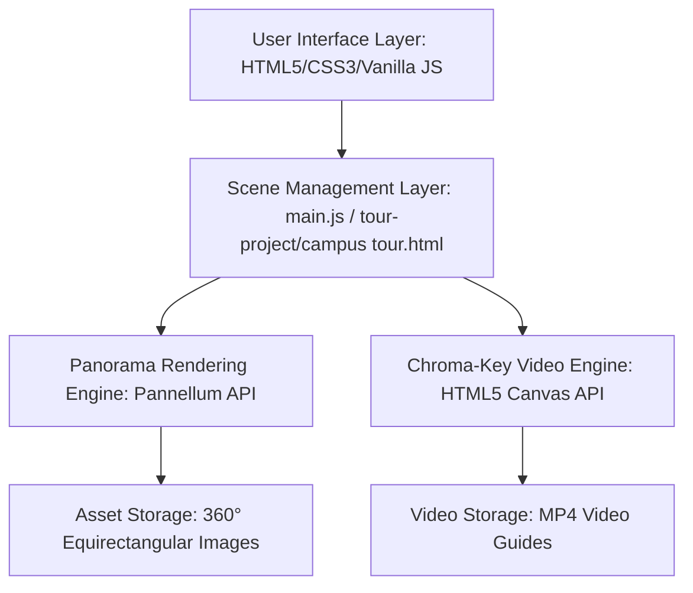

# 360 Interactive Campus Tour 

An immersive, web-based 360° virtual navigation and spatial exploration platform for the VIT Bhopal campus. This application features interactive stereoscopic VR capabilities and a real-time chroma-keyed virtual guide rendering engine, allowing prospective students, parents, and visitors to navigate and experience the campus environment remotely.

**Live Tour Portal:** [360-virtual-campur-tour.vercel.app](https://360-virtual-campur-tour.vercel.app/)

[](LICENSE)
[](https://github.com/amanrock1/360-VIRTUAL-CAMPUR-TOUR/stargazers)
[](https://pannellum.org/)
[](https://developer.mozilla.org/en-US/docs/Web/JavaScript)

---

## Overview 

Exploring large university campuses remotely poses a spatial understanding challenge. Standard static photo galleries and linear videos fail to convey architectural scale, connectivity, and environmental context. Visitors, incoming students, and parents often cannot visit the campus physically before enrollment or orientation.

This project addresses this issue by implementing a web-based, interactive 360° virtual tour. By combining high-definition equirectangular panoramic photography, web-based spherical projection mapping, and custom real-time pixel processing (chroma keying) for tour guide video overlays, the platform provides a self-guided spatial walkthrough of the campus grounds.

---

## Key Features 

| Feature | Technical Implementation | Description |
| :--- | :--- | :--- |
| **Interactive 360° Panorama** | Equirectangular projection rendering via the Pannellum API. | Users can drag, pan, and zoom across high-resolution panoramic views of campus sites. |
| **Spatial Hotspot Navigation** | Coordinate-mapped programmatic scene links. | Visual point-of-interest elements map relative physical connections to guide users between adjacent scenes. |
| **Stereoscopic VR Mode** | Dual-viewport synchronization via `requestAnimationFrame`. | Splits the display for mobile VR headsets, matching camera orientations across views without recursion loops. |
| **Chroma-Keyed Virtual Guide** | Real-time HTML5 Canvas pixel extraction and blending. | Programmatically removes green-screen backdrops from overlay guide videos, blending presenters into the 3D scene. |
| **Direct Navigation Sidebar** | Slide-out overlay linking to key destinations. | Provides direct jump points to major locations, bypassing step-by-step navigation. |
| **Performance-Optimized Core** | Texture capping, dynamic canvas scaling, and lazy scene instantiation. | Prevents frame-rate drops during real-time image manipulation on lower-end devices. |

---

## Technology Stack 

| Layer | Component / Library | Application & Usage |
| :--- | :--- | :--- |
| **Core Client Stack** | HTML5, CSS3, ES6+ JavaScript | Structural layout, responsive styles, event routing, and state machine control. |
| **Panorama Rendering Engine** | Pannellum (v2.5.6) | Projective mapping of equirectangular coordinates to sphere meshes inside the browser. |
| **Pixel Processing Pipeline** | HTML5 Canvas 2D API | Context operations executing real-time chroma subtraction on video frame buffers. |
| **Visual Resources** | Equirectangular Panoramic Photography, MP4 Video Guides | Media library containing 360° captures and green-screen guide recordings. |
| **Typography & Icons** | Outfit, Playfair Display (Google Fonts), FontAwesome 6 | Clean UI layouts and clear navigation controls. |

---

## Architecture 

The application structure consists of a presentation layer, a coordinate sync layer, and an asset storage pool. Visual guides are processed frame-by-frame and superimposed on top of the active panorama coordinates.



---

## Project Structure 

```
.
├── index.html                  # Main landing page and gateway portal
├── style.css                   # Homepage layout, styling system, and animation rules
├── main.js                     # Homepage interaction handlers and showcase controls
├── Credits.html                # Project credits and developer acknowledgment page
├── style1.css                  # Core CSS variables and styles
├── Style2.css                  # UI enhancement rules
├── styles3.css                 # Supplemental page styling
├── navbarstyle.css             # Navigation bar layout rules
├── footerstyle.css             # Footer structure and styling
├── style2gallery.css           # Styling rules for preview showcases
├── Vit Bhopal Logo.png         # Branding asset
├── Chancellor.png              # Academic leadership asset
├── tour-project/               # Main 360° Virtual Tour Module
│   ├── campus tour.html        # Virtual tour interactive hub (Pannellum + Canvas integration)
│   ├── style1.css              # Custom sidebar, control panel, and toolbar styling
│   ├── script.js               # Helper scripts for scene parameters
│   ├── *.jpg                   # High-resolution 360° equirectangular panoramic image files
│   └── videos/                 # Guide videos filmed on green screens
│       ├── Video Project 1 (1).mp4
│       ├── ab1 with green croped.mp4
│       ├── mph.mp4
│       ├── lc to ar .mp4
│       └── ab2.mp4
├── vr_tour/                    # Stereoscopic Virtual Reality Module
│   └── index.html              # Dual-viewer VR portal utilizing orientation sync
├── logo/                       # Visual identity assets
├── image copy/                 # Image backups and UI references
└── Drone_Background/           # Media assets containing drone photography
```

---

## Installation 

Since the application is built on static client technologies, compiling code or running a server environment is not required. However, because modern browsers restrict file access (`file://`) due to CORS policies, the project must be served from a local server to load panoramas and guide videos correctly.

### Prerequisites
- Node.js (v14+) or Python (v3+) installed on your machine.
- A modern web browser supporting WebGL and canvas manipulation.

### Setup Instructions
1. **Clone the Repository:**
   ```bash
   git clone https://github.com/amanrock1/360-VIRTUAL-CAMPUR-TOUR.git
   cd 360-VIRTUAL-CAMPUR-TOUR
   ```

2. **Serve the Application:**
   * **Using Python (Recommended):**
     ```bash
     python -m http.server 8000
     ```
   * **Using Node.js:**
     ```bash
     npx http-server -p 8000
     ```

3. **Launch in Browser:**
   Open your browser and navigate to `http://localhost:8000`.

---

## Usage 

1. **Enter the Campus Gateway:** On the landing page, read about the project scope, watch the media preview, and select "Enter Campus".
2. **Rotate and Look Around:** Click and drag using your mouse, or swipe on mobile screens, to rotate the panorama 360 degrees. Use the `+` and `-` controls in the toolbar to adjust your field of view.
3. **Move to Adjacent Locations:** Identify hotspot overlays within the scene. Hovering over a hotspot displays the destination name. Clicking the hotspot triggers a fade transition to that location.
4. **Utilize Quick Navigation:** Click the "☰ HOTSPOT" button on the top left of the screen to open the sidebar. Click any location label (e.g., Learning Center, Girls Hostel, Food Court) to warp directly to that scene.
5. **Activate VR Mode:** Click the VR goggles icon (🕶) in the bottom toolbar. Insert your mobile device into a VR viewer (e.g., Google Cardboard) to explore the campus using dual-pane stereo views.

---

## Screenshots 

*To add screenshots, replace the placeholders below with project image assets stored in your repository:*

#### Home Page / Landing Portal

*Figure 1: The gateway landing page showcasing introductory cards, team credits, and entry triggers.*

#### 360° Panoramic View

*Figure 2: The interactive campus viewer rendering equirectangular environment maps.*

#### Hotspot Navigation and Interactive Controls

*Figure 3: Overlaid spatial navigation links pointing to neighboring scenes.*

#### Stereoscopic VR Mode

*Figure 4: Dual-viewport output optimized for cardboard VR headsets.*

#### Mobile Layout View

*Figure 5: Optimized layout and collapsed menus running on mobile screens.*

---

## How Navigation Works 

- **Scene Transitions:** Handled by Pannellum’s programmatic `viewer.loadScene(sceneId)` API. When triggered, the engine swaps the underlying texture coordinates and performs a fade-out to fade-in transition.
- **Hotspot Mapping:** Declared statically in the tour config. Each hotspot holds spatial Euler angles (`pitch`, `yaw`) and a target `sceneId`.
- **Camera Orientation Sync:** To prevent disorienting camera movements during transition, the target scene's initial facing yaw is aligned dynamically based on the direction from which the visitor approached the hotspot.
- **User Input Routing:** Pointer events translate screen coordinates into changes in pitch and yaw. The interface supports keyboard arrow controls, scrollwheel zoom, and pinch-to-zoom touch actions.

---

## Performance Optimizations 

- **On-Demand Loading:** Panoramic assets are not loaded simultaneously. The engine requests the equirectangular image file only when its corresponding scene is loaded.
- **Dynamic Canvas Constraints:** Executing real-time pixel extraction on 1080p video frames causes high CPU usage. The pipeline scales the video frame onto a hidden canvas capped at a maximum width of 640 pixels prior to performing color extraction.
- **Frame Rate Synchronization:** Chroma key extraction loops are driven by `requestAnimationFrame`. This binds processing calculations to the monitor's native refresh rate, mitigating background tab CPU utilization.
- **Adaptive Layout System:** Media queries and CSS viewport scaling unit rules (such as `dvh` and `vw`) adjust button sizes and sidebar spacing dynamically to avoid breaking layouts on small screens.

---

## Challenges Faced 🧠

- **Establishing Orientation Continuity:** Swapping scenes often left users facing the wrong direction. We solved this by parsing the incoming path direction, calculating the opposite vector, and setting the camera's entry yaw (`targetYaw = (incomingYaw + 180) % 360`) to create a continuous walking sensation.
- **Low-Latency Stereoscopic Sync:** Standard VR frameworks require high resource consumption. We implemented dual Pannellum instances side-by-side. To prevent feedback loops and update lag, we configured an active-side detector. When a user drags one side, the system captures those coordinates and overrides the peer’s orientation directly (`setYaw(yaw, false)`), suppressing animation updates and synchronization lag.
- **Real-Time Web-Based Green Screen Subtraction:** Building a clean keying filter in pure JavaScript required balanced RGB thresholding. Simple chroma keys produce harsh green margins around edges. We solved this by using dominant color subtraction logic:
  ```javascript
  const maxRB = Math.max(r, b);
  if (g > maxRB + 20 && g > 70) {
      const dominance = g - maxRB;
      if (dominance > 45) {
          data[i + 3] = 0; // Transparent
      } else {
          data[i + 3] = Math.max(0, 255 - (dominance - 20) * 10); // Alpha edge smoothing
      }
  }
  ```
  This creates smooth alpha blending on the boundary pixels, resolving pixelation without WebGL shaders.
- **Viewport Constraints on Mobile Browsers:** Mobile address bars shift layouts dynamically. We resolved layout clipping by wrapping interactive elements in containers styled with Dynamic Viewport Heights (`100dvh`).

---

## Future Improvements 

- **Voice Narratives:** Incorporating text-to-speech audio logs for each campus building.
- **Conversational Agents:** Adding interactive chat helpers inside scenes to reply to student queries.
- **Visitor Heatmaps:** Implementing analytics to see which campus zones are visited most frequently.
- **Localization Options:** Providing translation files to switch UI languages.
- **Enhanced Accessibility:** Building screen-reader voice notifications and implementing keyboard-tab navigation maps.
- **Facility Interiors:** Expanding the tour database to include indoor floor maps of hostels, libraries, and laboratories.

---

## Learning Outcomes 

- **Spatial UX Design:** Mapping flat coordinate spaces into interactive spherical projections.
- **Advanced DOM Control:** Syncing multiple WebGL panorama canvases simultaneously.
- **Client-Side Image Manipulation:** Implementing low-level, frame-by-frame color channel edits on media streams.
- **Responsive Layout Design:** Deploying flexible control systems that scale across various devices and screens.
- **Performance Profiling:** Identifying frame-rate bottlenecks in JavaScript rendering loops and using canvas scaling to maintain performance.

---

## Contributing 

Contributions to expand the Virtual Tour database are welcome.

1. Fork the Project.
2. Create your Feature Branch:
   ```bash
   git checkout -b feature/AmazingFeature
   ```
3. Commit your Changes:
   ```bash
   git commit -m "Add some AmazingFeature"
   ```
4. Push to the Branch:
   ```bash
   git push origin feature/AmazingFeature
   ```
5. Open a Pull Request.

---

## License 

This project is licensed under the MIT License. See [LICENSE](LICENSE) for details.

---

## Author 

Developed by Project Exhibition 01 - Group 1:
- **Shoubhik Bhattacharya** - Frontend Developer
- **Aman Kumar Prabhat** - 360° Website Developer
